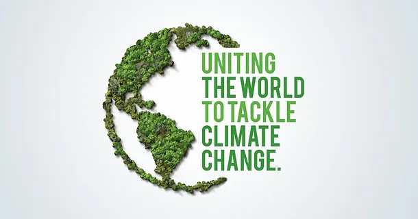
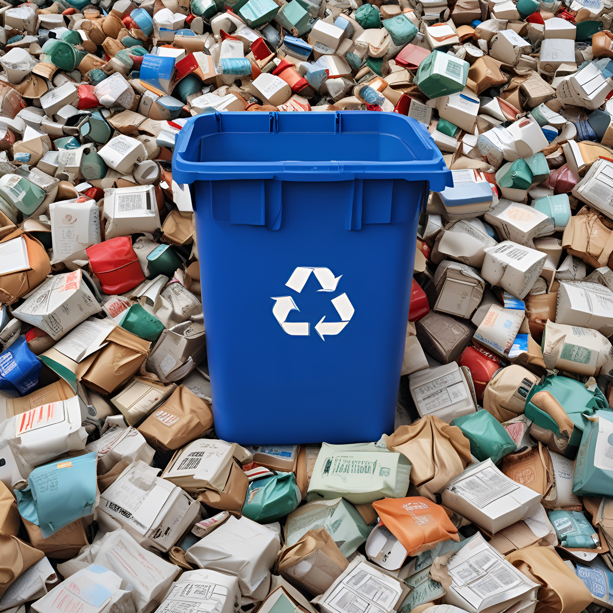
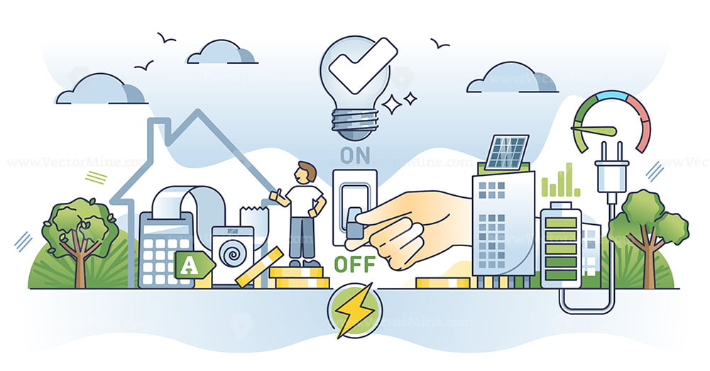
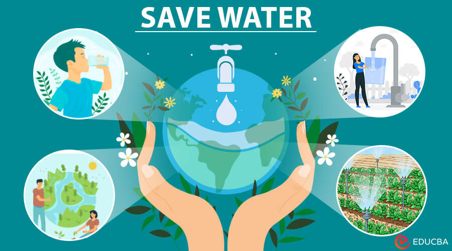

<html lang="en">
    <meta charset="UTF-8">
    <meta name="viewport" content="width=device-width, initial-scale=1.0">
    <title>yasilyasam</title>
    
    <body style="background-color: LawnGreen;">  
<body>
    <h2> 
 Yaşıl Yaşam  
 </h2>
    

   
    <ul>
        <li><a href="#section1">Zibillərin çeşidlənməsi</a></li>
        <li><a href="#section2">Enerjiyə qənaət  </a></li>
        <li><a href="#section3">Evdə enerjiyə qənaət </a></li>
        <li><a href="#section4">İşdə enerjiyə qənaət</a></li>
        <li><a href="#section5">Gündəlik həyatda enerjiyə qənaət</a></li>
        <li><a href="#section6">Suya qənaət</a></li>
  
    </ul>

    <section id="section1">
        
        

            Zibilin düzgün çeşidlənməsi tullantıların idarə edilməsinin effektivliyi üçün çox vacibdir. Tullanları müəyyən qaydalarda çeşidləsək həm də yenidən emal üçün əhəmiyyətli iş görmüş olarıq. 
             Məhsulların qablaşdırmasında təkrar emal işarələrini axtarın və təlimatlara əməl edin.Tullantıları ayırarkən onların təkrar emal üçün uyğun olması üçün təmiz və quru olduqlarını dəfələrlə yoxlayın. 
              
             İlk kateqoriya <b> üzvi tullantılar </b> haqqında danışaq.Bu nədir? Qida tullantıları, meyvə və tərəvəz qabıqları,yumurta qabıqları.Necə ayırmaq olar? Adətən qəhvəyi və ya yaşıl rəngli zibil qutularında yığılır. Gübrə hazırlamaq üçün istifadə edilə bilər.  
            Digər kateqoriya <b>kağızlar və kartonlar.</b> Qəzetlər, jurnallar, karton qutular, qablaşdırma kartonları bunların hamsı bu kateqoriyaya aidir. Necə ayırmalıq? İlk öncə bunların yenidən email üçün təmiz və quru olmalıdırlar. Yağlı və ya çirkli kağız təkrar emal üçün uyğun olmaya bilir. Adətən mavi rəngli zibil qutularına yığılır. 
            Başqa bir kateqoriyamız <b>plastiklərdir.</b>Plastik butulkalar, qapaqlar, çantalar, qablaşdırma materialları hamısı plastiklərdir.Necə ayırd edə bilərik? İlk öncə yumalıyıq və təmizləməliyik. müxtəlif növ plastik ola bilər problem yoxdur. Bunlar da adətən sarı qutulara yığılır. 
            <b>Şüşə butulkalar, şüşə qablaşdırmalar.</b> Bunlar necə ayırmalı? Şüşə məhsulları təmizlənməlidir. Şüşə butulkalar və bankalar adətən yaşıl, mavi və ya açıq rəngli qutulara bölünür. 
            <b>Təhlükəli tullantılar yəni batareyalar, batareyalar, köhnə elektron cihazlar, dərmanlar, kimyəvi maddələr</b> kimiləri xüsusi toplama məntəqələrinə və ya təkrar emal mərkəzlərinə çatdırılmalıdır. Bu tip tullantılar ümumiyyətlə məişət zibilləri ilə qarışdırılmamalıdır. 
            <b>Alüminium qutular, qalay qutular, metal qablaşdırmalar</b> isə təmiz və quru olmalıdır. Metal tullantıları adətən sarı rəngli qutulara yığılır. 
            Həll olunmayan və təkrar emal olunmayan tullantılar, çirkli uşaq bezləri, çirkli qablaşdırmalar boz və ya qara rəngli zibil qutularında yığılır. 
            Bu ayırma proseslərinə diqqət yetirərək, tullantıların daha səmərəli şəkildə təkrar emal edilməsini təmin edə bilərsiniz. 
        

        
    </section>

    <section id="section2">

        <h3> Enerjiyə qənaət </h3>
        
        
        

            Enerjiyə qənaət həm ətraf mühitə təsirləri azaltmaq, həm də xərcləri azaltmaq üçün mühüm addımdır. Evdə, işdə və gündəlik həyatda enerjiyə qənaət etmək üçün istifadə edə biləcəyiniz bəzi effektiv üsullar mövcuddur. Hər biri ilə yaxından tanış olaq.
            <section id="section3">
            <b>Evdə enerjiyə qənaətlə başlayaq:</b> 
            <b>İşıqlandırma</b> üçün LED lampalardan istifadə olunması məqsədə uyğundur çünki,aşağı enerji istehlakı və uzun ömürlüdürlər. Gün işığından ən yaxşı şəkildə istifadə edərək süni işıqlandırma ehtiyacını azaltmalıyıq. Otaq işıqlarının lazımsız yerə yanmasının qarşısını almaq üçün hərəkət sensoru işıqlarından və ya taymerlərdən istifadə edərək avtomatik söndürülə bilər. 
            <b>İsitmə və soyutma prosesləri </b> üçün termostatınızı isitmə üçün 20°C, soyutma üçün isə 24°C ətrafında qurun. Gecələr və ya evdə olmadıqda bu temperaturları daha da aşağı salın və ya artırın.Evinizin izolyasiyasını yaxşılaşdırmaqla enerji itkisini azaldın. Pəncərələrə pərdələr əlavə edin.Radiatorları mütəmadi olaraq təmizləyin. Yansıtıcı panelləri radiatorların qarşısına qoyun.
            <b>Elektrik cihazları</b> müxtəlifdir.Enerjiyə qənaət edən cihazları seçin (A+++ sinfi). İstifadə edilmədikdə cihazları söndürün və ya tamamilə ayırın.Paltar və Qabyuyan maşınlardan istifadə zamanı maşınınızı tam dolu halda istifadə edin və aşağı temperaturda işlədin. 
            </section>
        

            <section id="section4"> 
            

                <b> İşdə enerjiyə qənaət qaydaları ilə tanış olaq:</b> 
                <b> İşıqlandırma və İstilik:</b> Lazımsız işıqlandırmanı söndürün. Enerjiyə qənaət edən HVAC sistemlərindən istifadə edin və onlara müntəzəm qulluq edin. 
                <b> Enerji ilə çalışan cihazlar:</b> Kompüterlər və ofis avadanlıqları uzun müddət istifadə edilmədikdə enerjiyə qənaət rejimlərindən istifadə edin və lazım olmadıqda kompüterləri söndürün. Printerlərdən də istifadəyə diqqət edin. Belə ki,lazımsız çapı azaldın və enerjiyə qənaət edən printerlərdən istifadə edin. 
                <b> Enerji İdarəetmə:</b>  Enerji istehlakına nəzarət etmək və enerji istifadəsini qiymətləndirmək üçün enerji idarəetmə sistemlərindən istifadə edin.Enerjiyə qənaət haqqında işçiləri maarifləndirin və enerjiyə qənaət edən vərdişləri təşviq edin. 

            

            

                <section id="section5">             
                <b> Gündəlik həyatda enerjiyə qənaət:</b>  
                    <b>1.Nəqliyyat:</b> İctimai nəqliyyatdan istifadə edin və ya avtomobil paylaşmaqla yanacaq sərfiyyatını azaldın.Avtomobillərinizə müntəzəm texniki qulluq etməklə yanacaq səmərəliliyini artırın. 
                    <b>2.Mətbəxdə</b> qazan və tavaların qapaqlarını bağlı saxlamaqla bişirmə vaxtını qısaldın. Sobanı əvvəlcədən qızdırmadan bişirin və aşağı temperaturda bişirmə üsullarından istifadə edin. 
            </section>
            Enerjiyə qənaət həm ətraf mühitə təsiri azaldır, həm də büdcənizə töhfə verir. Bu üsulları tətbiq etməklə daha davamlı bir həyat tərzi keçirə bilərsiniz.
        

<section id="section6">  

    <h3> <b> Suya qənaət:</b>   </h3>
     
    Suya qənaət etmək suyun ehtiyatlı və səmərəli istifadəsi deməkdir. Su ehtiyatlarının həm fərdi, həm də cəmiyyət səviyyəsində davamlı şəkildə qorunması və istifadəsi vacibdir. Suya qənaət etmək üçün bəzi praktik tövsiyələr: 
    <b>Kranları bağlayın:</b> Dişlərinizi fırçalayarkən və ya əllərinizi yuyarkən kranı bağlı saxlayın. Həmçinin, kranları tam açmamağa diqqət edin. 
    <b>Qısa duş qəbul edin:</b> Duş vaxtınızı qısaltmaqla suya qənaət edə bilərsiniz. Orta hesabla 5-10 dəqiqə ideal vaxtdır. 
    <b>Suya qənaət edən kranlardan istifadə edin: </b>Aşağı axınlı duş başlıqları və kran aeratorlarından istifadə edərək su sərfiyyatını azalda bilərsiniz. 
    <b>Qabyuyan və Paltaryuyan Maşından istifadə:</b> Bu cihazları tam yüklənməmiş işə salmayın. Həmçinin, enerji və suya qənaət edən modelləri seçin. 
    <b>Bağçanın suvarılması:</b> Bağınızı səhər tezdən və ya axşam gec sulayın, beləliklə buxarlanma daha az olar. Bundan əlavə, yüksək su tutma qabiliyyətinə malik bitkilərdən və suya qənaət edən suvarma sistemlərindən istifadə edə bilərsiniz. 
    <b>Sızıntıları aradan qaldırın:</b> Kranlar, borular və ya tualetlərdəki sızmaları vaxtında təmir edin. Hətta kiçik sızmalar zamanla böyük miqdarda su itkisinə səbəb ola bilər. 
    <b>Su istifadəsini ölçün: </b>Su istehlakınızı izləmək və azaltmaq üçün su sayğaclarından və ya sayğaclardan istifadə edə bilərsiniz. 
    <b> Təkrar İstifadə Edilmiş Su İstifadəsi:</b> Siz yağış suyu toplama sistemlərini quraşdıraraq təkrar emal edilmiş sudan bağçanın suvarılması və ya digər istifadə məqsədləri üçün istifadə edə bilərsiniz. 
    <b> Təhsil və Maarifləndirmə: </b>Ailənizi və ətrafınızdakıları suya qənaət haqqında məlumatlandırın. Suyun şüurlu istifadəsi sosial səviyyədə böyük fərq yarada bilər. 
    Bu sadə tədbirlər su təchizatının qorunmasına kömək edə bilər və həm ətraf mühitə, həm də büdcənizə müsbət təsir göstərə bilər.     

 
</section>

